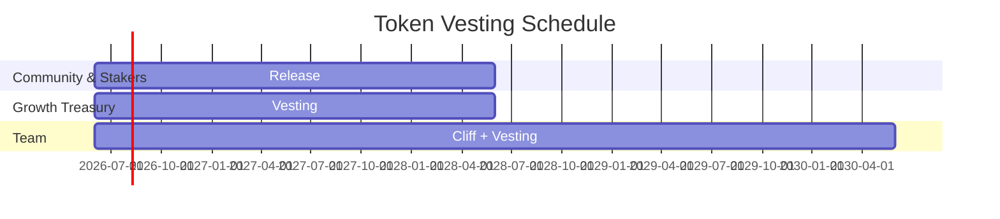
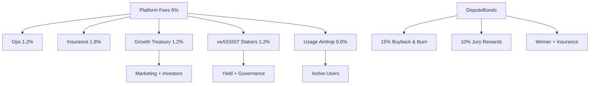
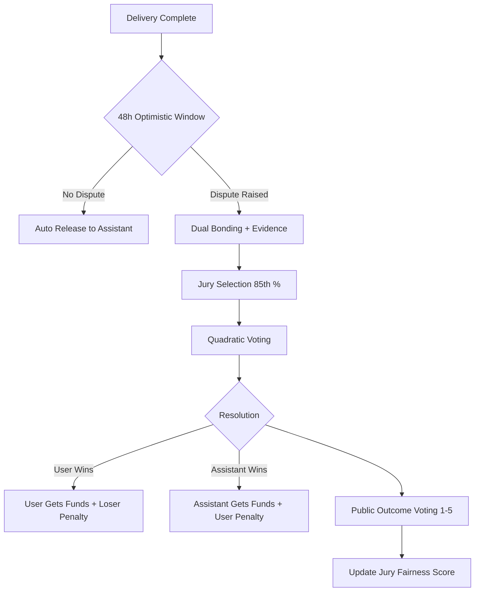

# BlockAssist Visual Charts (Mermaid)

## 1. Token Distribution & Vesting Schedule

```mermaid
gantt
    title Token Vesting Schedule
    dateFormat  YYYY-MM-DD
    section Community & Stakers
    Release : 2026-06-01, 24M
    section Growth Treasury
    Vesting : 2026-06-01, 24M
    section Team
    Cliff + Vesting : 2026-06-01, 48M
```

## 2. Token Flow Diagram

```mermaid
flowchart TD
    A[Platform Fees 6%] --> B[Ops 1.2%]
    A --> C[Insurance 1.8%]
    A --> D[Growth Treasury 1.2%]
    A --> E[veASSIST Stakers 1.2%]
    A --> F[Usage Airdrop 0.6%]
    
    D --> G[Marketing + Investors]
    E --> H[Yield + Governance]
    F --> I[Active Users]
    
    DisputeBonds --> J[15% Buyback & Burn]
    DisputeBonds --> K[10% Jury Rewards]
    DisputeBonds --> L[Winner + Insurance]
```

## 3. Dispute Resolution Flow

```mermaid
flowchart TD
    A[Delivery Complete] --> B{48h Optimistic Window}
    B -->|No Dispute| C[Auto Release to Assistant]
    B -->|Dispute Raised| D[Dual Bonding + Evidence]
    D --> E[Jury Selection 85th %]
    E --> F[Quadratic Voting]
    F --> G{Resolution}
    G -->|User Wins| H[User Gets Funds + Loser Penalty]
    G -->|Assistant Wins| I[Assistant Gets Funds + User Penalty]
    G --> J[Public Outcome Voting 1-5]
    J --> K[Update Jury Fairness Score]
```